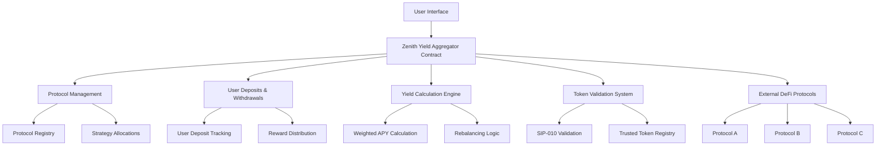
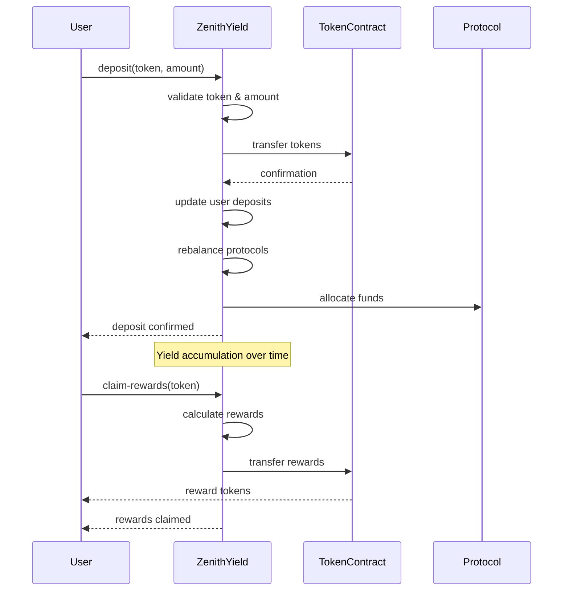

# Zenith Yield Aggregator


## Overview

Zenith Yield Aggregator is an advanced multi-protocol yield optimization platform built on the Stacks blockchain. It maximizes returns on digital assets through intelligent strategy allocation and automated rebalancing across multiple DeFi protocols. The platform empowers users to earn competitive yields while maintaining full control over their assets through a sophisticated, secure, and transparent smart contract infrastructure.

## Key Features

- **Multi-Protocol Yield Optimization**: Automatically distributes deposits across multiple high-yield protocols
- **Dynamic APY Optimization**: Real-time yield calculations based on weighted protocol performance
- **Risk-Adjusted Strategy Allocation**: Intelligent allocation mechanisms to balance risk and returns
- **SIP-010 Token Support**: Full compatibility with Stacks fungible token standard
- **Emergency Controls**: Built-in safety mechanisms including emergency shutdown functionality
- **Customizable Fee Structure**: Flexible platform fee management
- **Protocol Whitelisting**: Enhanced security through trusted protocol validation
- **Real-Time Analytics**: Comprehensive tracking of deposits, rewards, and protocol performance

## Architecture

### System Overview



### Contract Architecture

The Zenith Yield Aggregator is structured with modular components for maximum flexibility and security:

#### Core Components

1. **Trait Definitions**
   - `sip-010-trait`: Standard interface for fungible tokens on Stacks

2. **Data Management**
   - `user-deposits`: Tracks individual user deposit amounts and timestamps
   - `user-rewards`: Manages pending and claimed rewards for each user
   - `protocols`: Registry of supported yield protocols with APY data
   - `strategy-allocations`: Allocation percentages for each protocol
   - `whitelisted-tokens`: Approved tokens for platform usage
   - `trusted-token-contracts`: Additional security layer for token validation

3. **Protocol Management**
   - Dynamic protocol addition and status management
   - Real-time APY updates
   - Strategy allocation controls

4. **User Interaction Layer**
   - Secure deposit and withdrawal mechanisms
   - Automated reward calculation and distribution
   - Enhanced token validation

5. **Security Features**
   - Contract owner authorization
   - Emergency shutdown capabilities
   - Input validation and error handling
   - Trusted contract verification

### Data Flow



## Smart Contract Specifications

### Constants and Error Codes

- **Error Codes**: Comprehensive error handling with specific codes (1000-1013)
- **System Limits**: Configurable maximum protocol ID (100), APY limits (0-10000 basis points)
- **Protocol Status**: Binary active/inactive states for protocols

### Key Functions

#### Public Functions

- `add-protocol`: Register new yield protocols
- `update-protocol-status`: Enable/disable protocols
- `update-protocol-apy`: Update protocol yield rates
- `deposit`: User token deposits with validation
- `withdraw`: Secure token withdrawals
- `claim-rewards`: Reward distribution mechanism
- `set-platform-fee`: Fee structure management
- `whitelist-token`: Token approval system

#### Read-Only Functions

- `get-protocol`: Retrieve protocol information
- `get-user-deposit`: User deposit data
- `get-total-tvl`: Total value locked analytics
- `is-whitelisted`: Token whitelist validation

### Security Features

- **Owner-only Functions**: Critical administrative functions restricted to contract owner
- **Token Validation**: Multi-layer token verification including SIP-010 compliance
- **Emergency Controls**: Platform-wide emergency shutdown capability
- **Input Sanitization**: Comprehensive validation for all user inputs
- **Safe Math Operations**: Protected arithmetic operations to prevent overflow

## Getting Started

### Prerequisites

- [Clarinet](https://github.com/hirosystems/clarinet) - Stacks smart contract development tool
- [Node.js](https://nodejs.org/) (v18 or higher)
- [Stacks Wallet](https://www.hiro.so/wallet) for testing

### Installation

1. Clone the repository:

```bash
git clone https://github.com/opuelatei/zenith-yield.git
cd zenith-yield
```

2. Install dependencies:

```bash
npm install
```

3. Initialize Clarinet (if not already done):

```bash
clarinet check
```

### Testing

Run the test suite:

```bash
npm test
```

Run tests with coverage and cost analysis:

```bash
npm run test:report
```

Watch mode for continuous testing:

```bash
npm run test:watch
```

### Deployment

1. Configure network settings in `settings/` directory

2. Deploy using Clarinet:

```bash
clarinet deploy --network testnet
```

## Usage Examples

### Depositing Tokens

```clarity
;; Deposit 1000 STX tokens
(contract-call? .zenith-yield deposit .stx-token u1000000)
```

### Withdrawing Tokens

```clarity
;; Withdraw 500 STX tokens
(contract-call? .zenith-yield withdraw .stx-token u500000)
```

### Claiming Rewards

```clarity
;; Claim accumulated rewards
(contract-call? .zenith-yield claim-rewards .stx-token)
```

## Configuration

### Protocol Management

Administrators can add new protocols:

```clarity
(contract-call? .zenith-yield add-protocol u1 "Protocol-A" u500) ;; 5% APY
```

### Token Whitelisting

Add trusted tokens to the platform:

```clarity
(contract-call? .zenith-yield whitelist-token 'SP...token-contract)
(contract-call? .zenith-yield set-trusted-token-contract 'SP...token-contract true)
```

## Security Considerations

- **Access Control**: Only contract owner can perform administrative functions
- **Token Validation**: Dual-layer token verification (whitelisted + trusted contracts)
- **Emergency Mechanisms**: Platform shutdown capability for critical situations
- **Input Validation**: Comprehensive checks for all user inputs
- **Safe Transfers**: Protected token transfer operations with error handling

## Contributing

1. Fork the repository
2. Create a feature branch (`git checkout -b feature/amazing-feature`)
3. Commit your changes (`git commit -m 'Add amazing feature'`)
4. Push to the branch (`git push origin feature/amazing-feature`)
5. Open a Pull Request

### Development Guidelines

- Follow Clarity best practices
- Add comprehensive tests for new features
- Update documentation for API changes
- Ensure all tests pass before submitting PRs

## License

This project is licensed under the MIT License - see the [LICENSE](LICENSE) file for details.

## Support

For support and questions:

- Open an issue on GitHub
- Contact the development team
- Review the documentation

## Roadmap

- [ ] Multi-token support expansion
- [ ] Advanced yield farming strategies
- [ ] Cross-protocol arbitrage opportunities
- [ ] Governance token implementation
- [ ] Mobile application development
- [ ] Integration with major DeFi protocols
